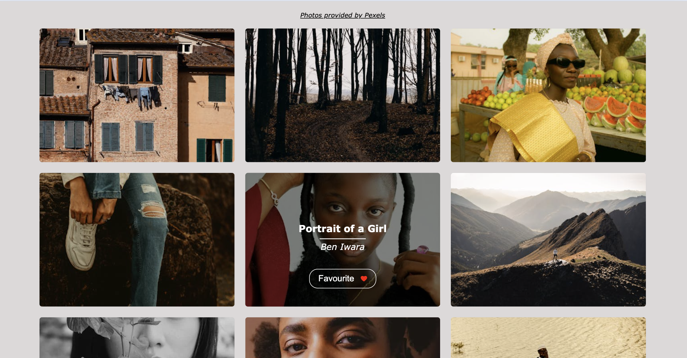
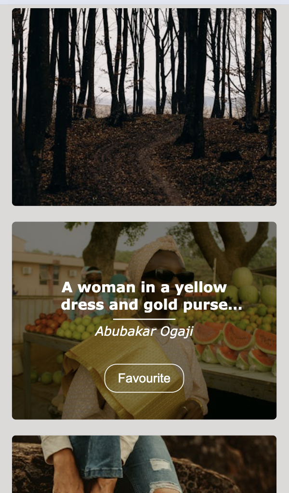

# React Infinite Scroll Web Application

This is a simple web application that allows users to browse items from the Pexels API and favorite them. The application features responsive design, infinite scroll, and the ability to save favorite items, which persist even after page reload.

## React Infinite Scroll Web Application
### Desktop image

### Mobile image

[See application live](https://augustej.github.io/react-scroll/)

## Comments on the process

I have created this React app using the default create-react-app command.

For responsive design, I targeted screens with widths of 375px, 820px, and 1440px. Images are loaded lazily. The implementation follows responsive image principles, selecting either a 'large' or 'large2x' image based on the width of the image displayed on the screen.

## Possible Improvements

1. Actual testing.
2. Better error handling.
3. Consider separating index.scss into multiple files.
4. Better naming of variables.
